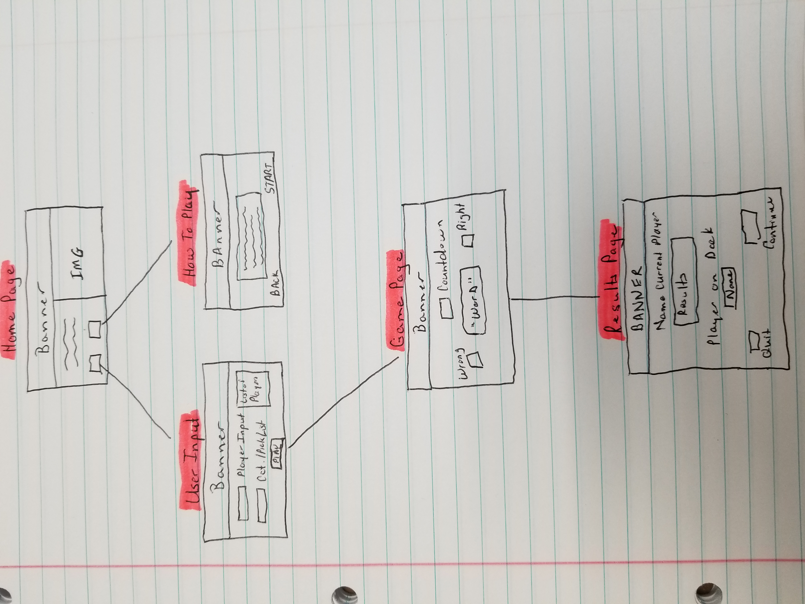

# Project Title
Fishbowl (actual name TBD)

# Description
Creating a site that will be mobile first with the intention that friends will be able to pass a phone or tablet between participants who are playing the classic fishbowl game.

# Initial Designs

# Team Memebers and Roles
Jonatan Martinez (lead) - Frontend/JS/Code-Review
Jeffrey McIntosh - Frontend
Ed Bock - JS

# Technologies Used
HTML, CSS, JavaScript, JQuery, AJAX/JSON, Bootstrap, Firebase. Adding Materialize as our new technology. For Project Management we are considering Trello or Git, or a mixture thereof.

# Breakdown of Tasks/Schedule
HTML Backbone
Instructions/Static Content
Home Page Logic
User Input Logic
How to Play Logic
Game Page Logic for 1 Round
Results Page
Putting all of the logic together
Styling
Create logic for other rounds
Extra Features
